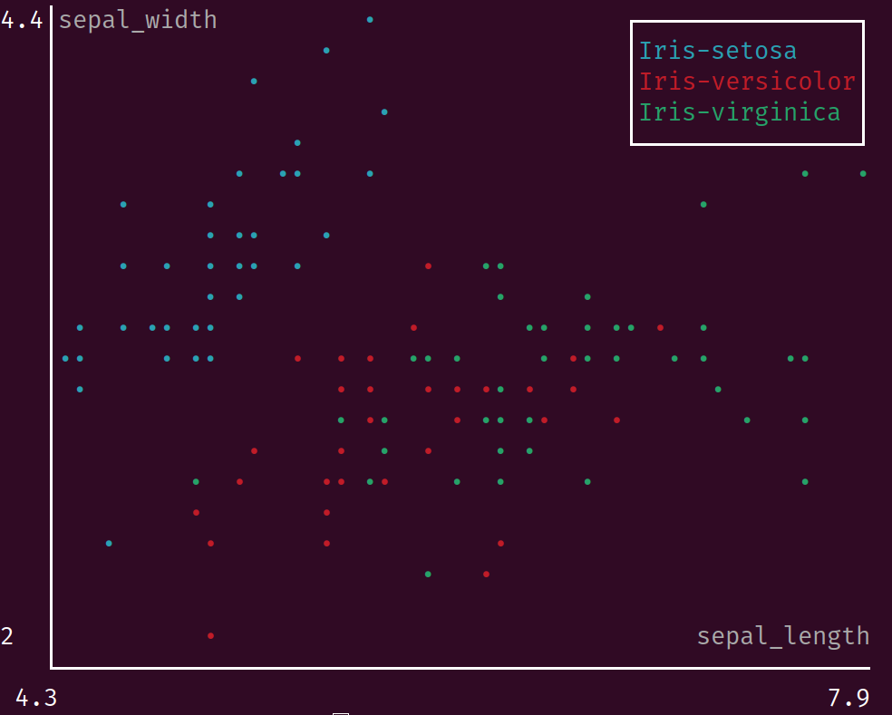
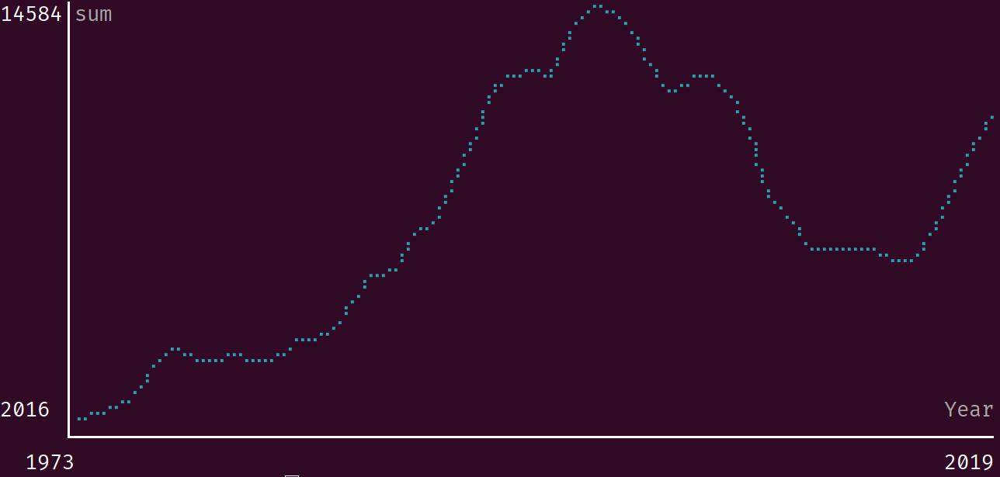

# Xan zine: May 2024 Edition

Upgrade to the latest version (at least 0.12.0) using:

```bash
cargo install xan
```

## Summary

* [Progress command](#progress-command)
* [Experimental plot command](#experimental-plot-command)
* [Renaming kway command as merge](#renaming-kway-command-as-merge)
* [Union-find command](#union-find-command)
* [Weighted sample](#weighted-sample)
* [fmt --quote-never](#fmt---quote-never)
* [New moonblade functions](#new-moonblade-functions)
* [Misc fixes](#misc-fixes)

## Progress command

Sometimes it would be nice to display a progress bar when working on a very large file, typically when performing costly operations line by line (e.g. when reading or writing files).

It is now possible thanks to the `progress` command that reads a CSV file line by line and forward them to `stdout` all while printing the desired progress bar.


The command is able to work at line or byte level. It will also prebuffer some of the file in order to find the total number of lines ahead of time etc.

What's more, the progress bar will be colored in green if the process exited successfuly, in yellow if it was interrupted by the user and in red if some error occurred.

```txt
Display a progress bar while reading the rows of a CSV file.

The command will try and buffer some of the ingested file to find
the total number of rows automatically. If you know the total
beforehand, you can also use the --total flag.

Usage:
    xan progress [options] [<input>]
    xan progress --help

progress options:
    -S, --smooth         Flush output buffer each time one row is written.
                         This makes the progress bar smoother, but might be
                         less performant.
    -B, --bytes          Display progress on file bytes, rather than parsing CSV lines.
    --prebuffer <n>      Number of megabytes of the file to prebuffer to attempt
                         knowing the progress bar total automatically.
                         [default: 64]
    --title <string>     Title of the loading bar.
    --total <n>          Total number of rows of given CSV file.

Common options:
    -h, --help             Display this message
    -n, --no-headers       When set, the first row will be included in
                           the progress bar total.
    -o, --output <file>    Write output to <file> instead of stdout.
    -d, --delimiter <arg>  The field delimiter for reading CSV data.
                           Must be a single character.
```

## Experimental plot command

An *experimental* (it's probably not perfectly stable) `plot` command was added to make sure anyone can draw scatter plots and line plots within a terminal.

Is this a good idea? Should we reaaaaally do that? Only time will tell.

*Scatter plot*

```bash
xan plot Year Revenues series.csv --cols 60 --rows 20
```



*Line plot*

```bash
xan groupby Year 'sum(Revenues) as sum' series.csv | \
xan transform sum trunc | \
xan plot --line Year sum --cols 80 --rows 20
```



```txt
Draw a scatter plot or a line plot based on 2-dimensional data.

Usage:
    xsv plot [options] <x> <y> [<input>]
    xsv plot --help

plot options:
    --line            Whether to draw a line plot instead of a scatter plot.
    --color <column>  Name of the categorical column that will be used to
                      color the different points.
    --cols <num>      Width of the graph in terminal columns, i.e. characters.
                      Defaults to using all your terminal's width or 80 if
                      terminal size cannot be found (i.e. when piping to file).
    --rows <num>      Height of the graph in terminal rows, i.e. characters.
                      Defaults to using all your terminal's height minus 2 or 30 if
                      terminal size cannot be found (i.e. when piping to file).
    --marker <name>   Marker to use. Can be one of (by order of size): 'braille', 'dot',
                      'halfblock', 'bar', 'block'.
                      [default: braille]

Common options:
    -h, --help             Display this message
    -n, --no-headers       When set, the file will be considered as having no
                           headers.
    -d, --delimiter <arg>  The field delimiter for reading CSV data.
                           Must be a single character. [default: ,]
```

## Renaming kway command as merge

The `kway` (🧥) term was tied to the underlying implementation of the command (relying on the [k-way merge algorithm](https://en.wikipedia.org/wiki/K-way_merge_algorithm)) which is obscure for most people. The command was therefore renamed as `xan merge` which is a little bit clearer.

As a reminder, this command is able to "merge" multiple CSV files sharing both the same columns and row order into a single ordered file (not a simple concatenation).

## Union-find command

An experimental `union-find` command was added to `xan`. It is based on the very famous [Union-Find](https://en.wikipedia.org/wiki/Disjoint-set_data_structure) algorithm and is able to label the connected components of a graph, represented here by a CSV file of edges with a column for sources and another one for targets.

It returns a CSV file of nodes and the attached labels. It is also able to return a CSV file of nodes contained within the largest components, or even a CSV file of connected component sizes. It runs in `O(E)` time and `O(N)` memory, `E` being the number of edges, i.e. the number of lines of the input file, and `N` being the number of nodes in the graph.

```txt
Apply the union-find algorithm on a CSV file representing a graph's
edge list (one column for source nodes, one column for target nodes) in
order to return a CSV of nodes with a component label.

The command can also return only the nodes belonging to the largest connected
component using the -L/--largest flag or the sizes of all the connected
components of the graph using the -S/--sizes flag.

Usage:
    xan union-find <source> <target> [options] [<input>]
    xan union-find --help

union-find options:
    -L, --largest  Only return nodes belonging to the largest component.
                   The output CSV file will only contain a 'node' column in
                   this case.
    -S, --sizes    Return a single CSV column containing the sizes of the graph's
                   various connected components.

Common options:
    -h, --help             Display this message
    -o, --output <file>    Write output to <file> instead of stdout.
    -n, --no-headers       When set, the first row will not be interpreted
                           as headers.
    -d, --delimiter <arg>  The field delimiter for reading CSV data.
                           Must be a single character.
```

## Weighted sample

The `sample` command can now be biased using a weight column given to the command through the `-w/--weight` flag.

It uses the `A-Res` variant of the [Reservoir Sampling](https://en.wikipedia.org/wiki/Reservoir_sampling) algorithm and runs in `O(n)` time and `O(k)` memory, `n` being the number of rows and `k` the size of desired sample.

*Example*

```bash
xan sample 100 -w count file.csv > sample.csv
```

## fmt --quote-never

A `--quote-never` flag was added to the `fmt` command. It makes sure no quotes will ever be added to the resulting CSV file, which probably produces, ironically, an invalid CSV file...

Wait, come back. It's not as silly as it sounds. The typical use case for this is to print a CSV column as "raw" lines that can be processed by bash utils. It can also be used to format lines in a certain way when you know what you are doing.

Typical use case would be to pipe a series of paths to the `xargs` command:

```bash
xan select path file.csv | \
xan behead | \
xan fmt --quote-never | \
xargs -P 4 -I {} rm {};
```

## New moonblade functions

* `count_empty`: a new aggregation function counting the number of empty values.
* `ext`: a function returning the extension of some file, given its path.
* `write`: a function able to write files on disk.

## Misc fixes

* `xan hist -SR` now displays colors properly.
* Automatic delimiter decision based on file extension `.tsv`, `.csv` is now working properly, even with gzipped files.
